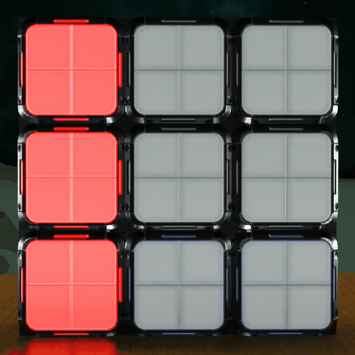
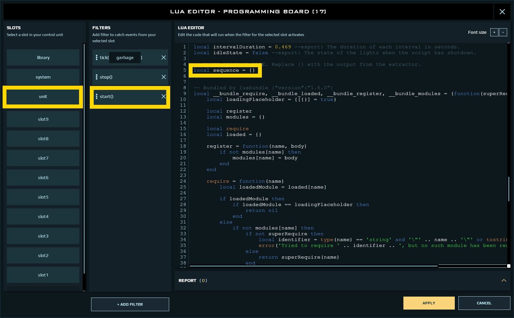
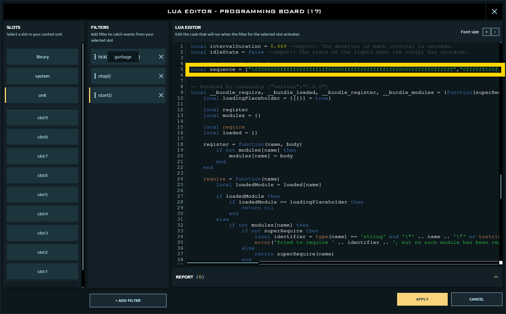

# DU Light Controller
This is a collection of Lua scripts for programming light sequences in the game Dual Universe.
Get the latest version from the [releases page](https://github.com/lgfrbcsgo/du-light-controller/releases).

## Tutorial
The tutorial assumes you own a Starter Kit. 
Blueprints for Starter Kits are available at

::pos{0,2,-1.3446,-49.6236,17.1239}

**VR:** DU Light Controller

### Scripts
There are three scripts for programming and controlling lights.
The Starter Kit has all three scripts pre-installed and all elements connected already.

> Usually one would overwrite the Programmer script with the Sequencer script once the sequence has been programmed.
> However, for demonstration purposes both scripts are installed on separate programming boards on the Starter Kit.

#### Programmer
The Programmer script, as the name suggests, is for programming a light sequence.

You can connect up to 9 lights to it. It also must be connected to one Databank.

Examine the connections of the programming board, which is labeled "Programmer", on the backside of the Starter Kit.

#### Extractor
The Extractor script is for extracting the light sequence from the Databank 
once you're done programming the sequence.

It must be connected to the same Databank as the Programmer script. 
It also must be connected to a screen (any type of screen).

Examine the connections of the programming board, which is labeled "Extractor", on the backside of the Starter Kit.

#### Sequencer
The Sequencer script is for playing back an extracted sequence.

It must be connected to the same lights as the Programmer script.
The lights must be connected to the programming board in the same order 
in which they were connected to the programming board of the Programmer script. 

> It is usually easiest to just overwrite the Programmer script with the Sequencer script.

Examine the connections of the programming board, which is labeled "Sequencer", on the backside of the Starter Kit.

### Programming a sequence
For this section *activate* the programming board which is labeled "Programmer".

> **Important:** Activating any of the other programming boards while the Programmer script is active will mess up your sequence.
>
> Avoid programming a light sequence in a busy area as server lag may mess up your sequence.

The Starter Kit comes with a pre-programmed sequence. 

Press Alt+1 to play it back.

> In case you forget any of the hotkeys or have remapped your key bindings, 
> you can always look them up in the Lua tab of the in-game chat.

Press Alt+1 again to exit the playback mode.

#### Navigating the sequence

A light sequence is just that, a sequence of steps.
You can navigate the steps by pressing Alt+A and Alt+D.

Pressing Alt+A will select the previous step. 
If there is no previous step, pressing Alt+A will do nothing.

Pressing Alt+D will select the next step.
If there are no more next steps, pressing Alt+D will create a new step.

Press Alt+D and Alt+A a few times to navigate the sequence.

If you want to navigate a very long sequence, you can press Alt+2 to enter the "fast travel" mode.
In fast travel mode pressing Alt+A and Alt+D will jump 10 steps.
You can leave the fast travel mode by pressing Alt+2 again.

#### Modifying a step

You can make changes to a step by turning a light on or off, or by changing its color.
You can change the color of a light by right clicking it and selecting "Set RGB color" in the "Advanced" sub menu.

Modify some steps and play back the modified sequence by pressing Alt+1.
Once you're done, press Alt+1 again.

#### Inserting and deleting steps

Pressing Alt+D adds a step once you have reached the end of the sequence.
In case you want to add a step in the middle of the sequence, you can press Alt+3 or Alt+4.

Pressing Alt+3 will insert a step before your currently selected step and select it.

Pressing Alt+4 will insert a step after your currently selected step and select it.

You can delete a step by pressing Alt+9. 
The next step will be selected after you have deleted a step. 
In case there are no next steps the previous step will be selected.

#### Copying and pasting a step

You can copy a step by pressing Alt+5.

Pressing Alt+6 will paste the copied step into the currently selected step. 

#### Replacing colors of a step `[advanced]`

In case you want to change the color of multiple lights within a step you can use the `replace ... with ...` command.

Open the Lua tab in the in-game chat to issue a command. Simply type a command into the chat and press ENTER.

- `replace 255,255,255 with 255,0,0` will change the color of all white lights to red.
- `replace !255,255,255 with 255,0,0` will change the color of all white lights, which are currently switched off, to red while also turning the lights on.
- `replace 255,255,255 with !255,0,0` will change the color of all white lights to red while also switching the lights off.
- `replace !255,255,255 with !255,0,0` will change the color of all white lights, which are currently switched off, to red.

### Extracting a sequence from the Databank and playing it back with the "Sequencer" script.
For this section *deactivate* the programming board which is labeled "Programmer".

> **Important:** The Programmer script mustn't be active when activating any of the other two scripts.
> Activating any of the other programming boards, while the Programmer script is active, will mess up your sequence.

While the sequence can be played back with the "Programmer" script, it is not very convenient.
Ideally, the sequence would be played back as soon as the programming board is activated. 

The "Programmer" script also has another drawback:
To play back a sequence you need to be within 35 meters of the Databank, otherwise the playback will simply stop.

We can fix that by extracting the sequence from the Databank and playing it back using the "Sequencer" script.

So, once you're done programming your sequence, activate the programming board, which is labeled "Extractor".
This will write the sequence from the Databank to the screen which is attached to it.
However, you won't be able to see the sequence by directly looking at the screen.

To see the sequence you need to right click the screen and select "Edit HTML content" in the "Advanced" sub menu.

You should now see a long string of numbers and letters in a new window. 
Copy this string by selecting it and then pressing Ctrl+C.
You can now close the window.

Look at the programming board, which is labeled "Sequencer", and press Crtl+L. 
Alternatively, you can right click the programming board and select "Edit Lua script" in the "Advanced" sub menu.

This should have opened another window. On the left-hand side of the window select "system" and then "start()".

You should be seeing a lot of text now. 
There should be a line `local sequence = {}`. 
Select the curly braces at the end of the line and press Ctrl+V to paste the sequence which we have just copied.
The result should look something like this.

Close the window by pressing "Apply" in the bottom right corner.

Activate the programming board which is labeled "Sequencer".
If you've followed all the steps, your sequence should be playing.
Deactivate the programming board again to stop the playback.

## Programming more than 9 lights
To program more than 9 lights you can use multiple programming boards.
The Extractor can be connected to up to 9 Databanks.
Each line in the Extractor output corresponds to one Databank.
The order of the lines depends solely on the oder in which the Databanks were connected.
